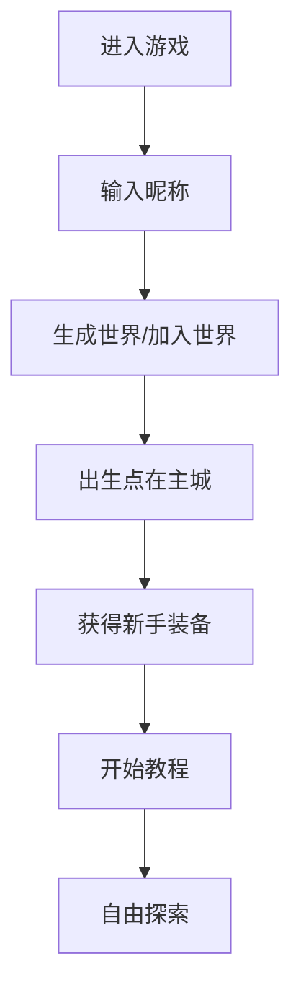
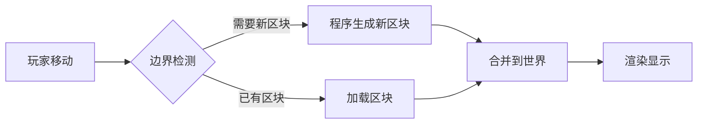
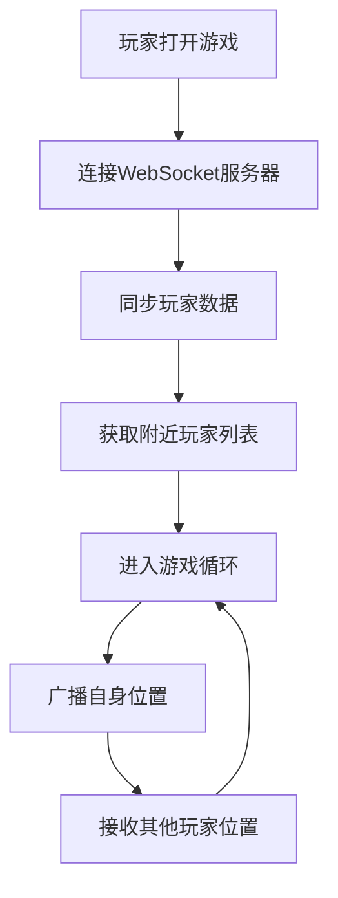

# 田园大世界 - 产品需求文档

## 1. 产品概述

**项目名称**：田园大世界
**项目类型**：2D像素风格休闲种田大世界网页游戏

一款纯网页端运行的开放式种田养殖大世界游戏，玩家可以在程序自动生成的无限扩展地图中自由探索、种植作物、养殖动物、建造家园。全服玩家实时联机，共同生活在这个像素风格的田园世界中。

### 目标用户
- 喜欢种田类游戏（星露谷物语、牧场物语）的玩家
- 追求休闲放松、佛系养成的玩家
- 喜欢开放式探索和社交的玩家
- 希望在浏览器中随时随地游玩的玩家

### 核心价值
- 无需下载，即开即玩
- 无限扩展的程序化生成世界
- 纯前端实现，降低服务器成本
- 跨平台适配，支持电脑和手机

---

## 2. 核心功能

### 2.1 玩家角色
| 属性 | 说明 |
|------|------|
| 玩家名称 | 自定义昵称 |
| 金币 | 游戏内货币，用于购买种子、动物等 |
| 体力 | 行动消耗，可通过休息恢复 |
| 背包 | 存放物品，支持道具拾取 |

### 2.2 功能模块

#### 2.2.1 程序化生成大世界
- **无限地图**：基于种子（seed）的程序化生成，玩家向任意方向探索都会生成新区块
- **地形类型**：草地、森林、山地、湖泊、沙漠、雪地等
- **资源分布**：不同地形产出不同资源（矿石、木材、浆果、药材）
- **聚落系统**：随机生成的NPC村落、商店、任务点

#### 2.2.2 种田系统
- **耕地**：使用锄头开垦土地
- **播种**：种植各种作物（胡萝卜、小麦、番茄、南瓜等）
- **浇水**：为作物浇水促进生长
- **收获**：作物成熟后收获获得金币
- **季节**：作物有适合种植的季节

#### 2.2.3 养殖系统
- **动物栏**：建造鸡舍、畜棚
- **饲养动物**：购买并喂养鸡、牛、羊、猪等
- **产出收集**：收集鸡蛋、牛奶、羊毛等
- **动物好感度**：好感度越高产出越好

#### 2.2.4 建造系统
- **家具制作**：制作桌子、椅子、灯饰等
- **建筑建造**：建造仓库、温室、加工厂
- **家园装饰**：自定义家园外观和布局

#### 2.2.5 社交系统
- **玩家位置**：小地图显示附近玩家
- **实时聊天**：世界频道聊天
- **拜访好友**：访问其他玩家家园
- **交易系统**：玩家之间交易物品

#### 2.2.6 任务系统
- **新手引导**：引导玩家熟悉基本操作
- **每日任务**：每日刷新的小任务
- **成就系统**：解锁成就获得奖励

---

## 3. 核心流程

### 3.1 玩家进入流程



### 3.2 探索流程



### 3.3 联机流程



---

## 4. 界面设计

### 4.1 设计风格

#### 像素风格
- **像素密度**：16x16基础像素块
- **调色盘**：温暖的田园色调
  - 主色：#7EC850（草地绿）
  - 次色：#5B9BD5（天空蓝）
  - 强调色：#F5A623（阳光金）
  - 地面：#C4A46B（泥土棕）
- **动画**：逐帧像素动画

#### 界面风格
- **窗体**：圆角木质边框
- **按钮**：像素风格立体按钮
- **图标**：统一像素风格图标
- **字体**：像素风格字体

### 4.2 页面结构

| 页面 | 模块 | 说明 |
|------|------|------|
| 加载页 | Logo动画、进度条 | 游戏加载显示 |
| 登录页 | 昵称输入、开始按钮 | 输入名称进入游戏 |
| 游戏主界面 | 地图视图、UI层、HUD | 核心游戏界面 |
| 物品栏 | 物品网格、背包分类 | 查看和使用物品 |
| 建造菜单 | 分类列表、物品预览 | 建造和制作 |
| 商店界面 | 商品列表、价格 | 购买种子、动物 |
| 设置界面 | 音乐、音效、画质 | 游戏设置 |

### 4.3 游戏主界面布局

```
┌─────────────────────────────────────┐
│  金币: 1000  🌾 体力: 100/100       │  ← 顶部状态栏
├─────────────────────────────────────┤
│                                     │
│                                     │
│           游戏地图视图               │  ← 中央主视图
│         (玩家可缩放/拖拽)            │
│                                     │
│                                     │
├─────────────────────────────────────┤
│  [背包] [技能] [地图] [社交] [设置]  │  ← 底部快捷栏
└─────────────────────────────────────┘
```

### 4.4 响应式设计

- **电脑端**：鼠标操控，支持键盘快捷键
- **手机端**：触控操作，虚拟摇杆
- **自适应**：根据屏幕尺寸调整UI大小

---

## 5. 游戏数值

### 5.1 基础数值

| 数值 | 初始值 | 最大值 | 说明 |
|------|--------|--------|------|
| 金币 | 0 | 无上限 | 游戏货币 |
| 体力 | 100 | 100 | 行动消耗 |
| 饥饿度 | 100 | 100 | 随时间下降 |

### 5.2 作物数据

| 作物 | 成本 | 生长时间 | 售价 | 季节 |
|------|------|----------|------|------|
| 胡萝卜 | 10 | 3天 | 25 | 春 |
| 小麦 | 15 | 4天 | 35 | 夏 |
| 番茄 | 20 | 5天 | 50 | 夏 |
| 南瓜 | 25 | 7天 | 80 | 秋 |
| 土豆 | 10 | 4天 | 30 | 春/秋 |

### 5.3 动物数据

| 动物 | 购买价格 | 产出品 | 好感度影响 |
|------|----------|--------|------------|
| 鸡 | 200 | 鸡蛋 | 高时双蛋 |
| 牛 | 500 | 牛奶 | 高时出金奶 |
| 羊 | 800 | 羊毛 | 高时加速 |
| 猪 | 1000 | 松露 | 高时量大 |

---

## 6. 技术实现

### 6.1 纯前端架构
- **渲染**：Canvas 2D 渲染像素画面
- **状态**：React + Hooks 管理游戏状态
- **存储**：LocalStorage 保存玩家数据
- **联机**：WebSocket 实现多人同步

### 6.2 程序化生成
- **算法**：Simplex Noise 用于地形生成
- **区块**：分块加载，每块 16x16 格
- **种子**：世界种子保证地图可复现

### 6.3 性能优化
- **视口裁剪**：只渲染可见区域
- **对象池**：物品和实体复用
- **懒加载**：按需加载远距离区块
