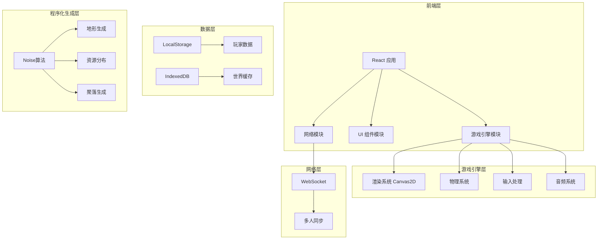
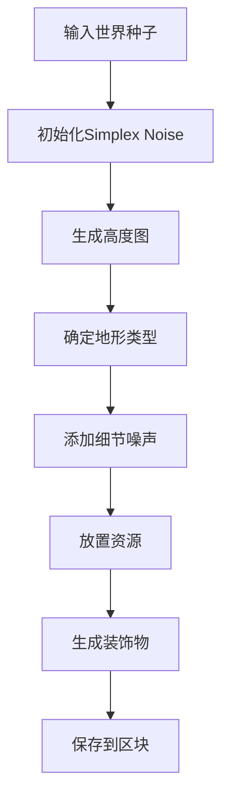

# 田园大世界 - 技术架构文档

## 1. 架构设计



## 2. 技术选型

### 2.1 核心技术栈

| 技术 | 用途 | 版本 |
|------|------|------|
| React | UI框架 | 18.x |
| TypeScript | 类型安全 | 5.x |
| Vite | 构建工具 | 5.x |
| TailwindCSS | 样式框架 | 3.x |
| Canvas API | 游戏渲染 | 2D |
| WebSocket | 多人联机 | - |

### 2.2 游戏专用库

| 库 | 用途 |
|---|------|
| simplex-noise | 程序化地形生成 |
| howler.js | 音频播放 |
| @use-gesture | 触控手势处理 |

### 2.3 项目结构

```
/src
├── /components      # React UI组件
│   ├── /ui          # 通用UI组件
│   ├── /game        # 游戏内UI
│   └── /menus       # 菜单界面
├── /engine          # 游戏引擎核心
│   ├── /core        # 核心类（Game, Entity）
│   ├── /renderer    # 渲染系统
│   ├── /physics     # 物理系统
│   ├── /input       # 输入处理
│   └── /audio       # 音频系统
├── /world           # 世界生成系统
│   ├── /generator   # 程序化生成
│   ├── /chunks       # 区块管理
│   └── /terrain      # 地形系统
├── /entities        # 游戏实体
│   ├── /player      # 玩家
│   ├── /npc         # NPC
│   ├── /crops       # 作物
│   └── /animals     # 动物
├── /systems         # 游戏系统
│   ├── /inventory   # 背包系统
│   ├── /crafting    # 制作系统
│   ├── /farming     # 种田系统
│   └── /social      # 社交系统
├── /network         # 网络通信
│   ├── /websocket   # WebSocket客户端
│   └── /sync        # 数据同步
├── /hooks           # React Hooks
├── /stores          # 状态管理
├── /utils           # 工具函数
└── /assets          # 静态资源
    ├── /sprites     # 像素精灵图
    ├── /audio       # 音效音乐
    └── /fonts       # 像素字体
```

## 3. 路由定义

| 路由 | 组件 | 说明 |
|------|------|------|
| / | GameLoader | 游戏加载页 |
| /login | LoginScreen | 登录页（输入昵称） |
| /game | GameScreen | 主游戏界面 |
| /settings | SettingsModal | 设置弹窗 |

## 4. 核心数据结构

### 4.1 玩家数据

```typescript
interface Player {
  id: string;
  name: string;
  x: number;
  y: number;
  direction: 'up' | 'down' | 'left' | 'right';
  coins: number;
  energy: number;
  maxEnergy: number;
  inventory: InventorySlot[];
  farmLevel: number;
  friends: string[];
}

interface InventorySlot {
  itemId: string;
  count: number;
  metadata?: any;
}
```

### 4.2 世界数据

```typescript
interface World {
  seed: number;
  chunks: Map<string, Chunk>;
  players: Map<string, Player>;
}

interface Chunk {
  x: number;
  y: number;
  tiles: TileType[][];
  entities: Entity[];
  decorations: Decoration[];
}

interface TileType {
  type: 'grass' | 'water' | 'stone' | 'sand' | 'snow';
  height: number;
  resource?: ResourceType;
}
```

### 4.3 作物数据

```typescript
interface Crop {
  id: string;
  type: CropType;
  x: number;
  y: number;
  plantedAt: number;
  stage: 'seed' | 'sprout' | 'growing' | 'mature';
  waterLevel: number;
}
```

## 5. 程序化生成算法

### 5.1 地形生成流程



### 5.2 区块坐标计算

```typescript
// 区块坐标 = 像素坐标 / 区块大小
const CHUNK_SIZE = 16;

function getChunkCoord(pixel: number): number {
  return Math.floor(pixel / CHUNK_SIZE);
}

// 世界坐标转区块
function pixelToChunk(x: number, y: number): {cx, cy} {
  return {
    cx: Math.floor(x / CHUNK_SIZE),
    cy: Math.floor(y / CHUNK_SIZE)
  };
}
```

## 6. 渲染架构

### 6.1 分层渲染

```
┌─────────────────────────────┐
│      UI Layer (HTML)        │  ← React组件
├─────────────────────────────┤
│     HUD Layer (Canvas)       │  ← 状态栏、小地图
├─────────────────────────────┤
│    Entity Layer (Canvas)    │  ← 玩家、NPC、动物
├─────────────────────────────┤
│    Tile Layer (Canvas)      │  ← 地形、作物
└─────────────────────────────┘
```

### 6.2 视口裁剪

```typescript
// 只渲染视口内的区块
function getVisibleChunks(viewport: Rect, world: World): Chunk[] {
  const startX = Math.floor(viewport.x / CHUNK_SIZE) - 1;
  const startY = Math.floor(viewport.y / CHUNK_SIZE) - 1;
  const endX = Math.ceil((viewport.x + viewport.width) / CHUNK_SIZE) + 1;
  const endY = Math.ceil((viewport.y + viewport.height) / CHUNK_SIZE) + 1;
  
  // 返回可见区块...
}
```

## 7. 多人同步方案

### 7.1 WebSocket消息类型

| 消息类型 | 方向 | 说明 |
|----------|------|------|
| JOIN | C→S | 玩家加入 |
| LEAVE | C→S | 玩家离开 |
| MOVE | C→S | 位置更新 |
| SYNC | S→C | 全量同步 |
| CHAT | C→S/S→C | 聊天消息 |
| ACTION | C→S | 交互动作 |

### 7.2 同步策略

- **位置同步**：每100ms广播一次位置
- **实体同步**：状态变化时立即同步
- **区块同步**：按需加载，玩家进入新区域时同步

## 8. 性能优化策略

### 8.1 渲染优化
- 脏矩形更新，只重绘变化区域
- 精灵图合并，减少drawCall
- 帧率控制，限制60fps

### 8.2 内存优化
- 对象池复用Entity对象
- 区块LRU缓存，超出限制卸载
- 图片懒加载

### 8.3 网络优化
- 消息压缩
- 批量更新
- 差量同步
