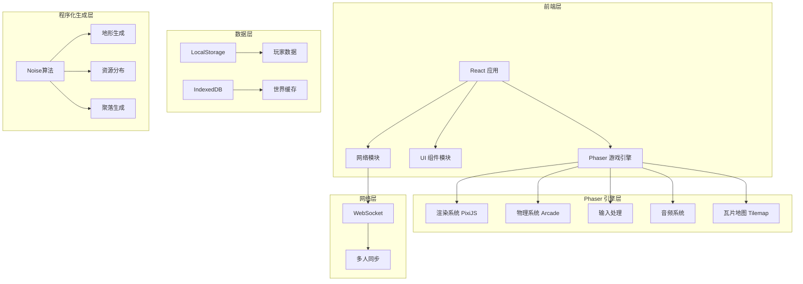
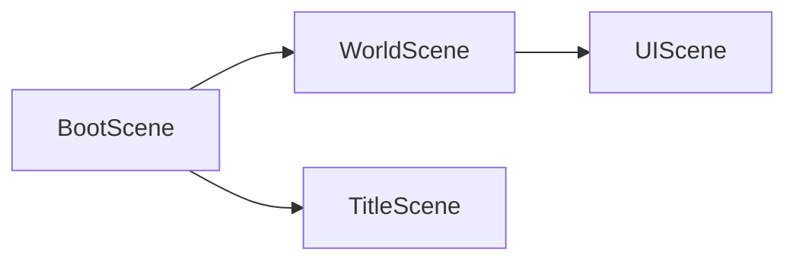
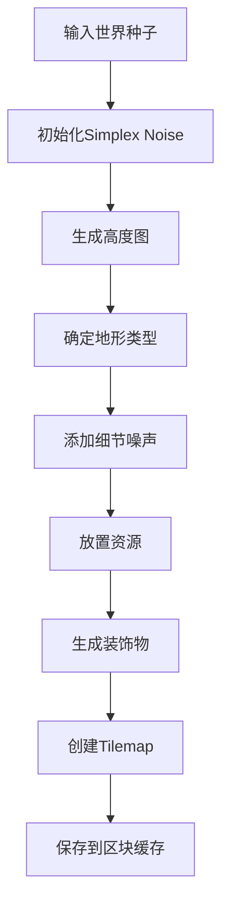

# 田园大世界 - 技术架构文档

## 1. 架构设计



## 2. 技术选型

### 2.1 核心技术栈

| 技术 | 用途 | 版本 |
|------|------|------|
| React | UI框架 | 18.x |
| TypeScript | 类型安全 | 5.x |
| Vite | 构建工具 | 5.x |
| TailwindCSS | 样式框架 | 3.x |
| Phaser | 2D游戏引擎 | 3.x |
| react-phaser-fiber | React-Phaser集成 | 8.x |

### 2.2 Phaser 核心模块

| 模块 | 用途 |
|------|------|
| Phaser.Game | 游戏主实例 |
| Phaser.Scene | 场景管理 |
| Phaser.Physics.Arcade | 物理系统 |
| Phaser.Tilemaps | 瓦片地图 |
| Phaser.GameObjects.Sprite | 精灵渲染 |
| Phaser.Cameras | 摄像机系统 |

### 2.3 游戏专用库

| 库 | 用途 |
|---|------|
| simplex-noise | 程序化地形生成 |
| howler.js | 音频播放 |
| @use-gesture | 触控手势处理 |

### 2.4 项目结构

```
/src
├── /components      # React UI组件
│   ├── /ui          # 通用UI组件
│   ├── /game        # 游戏内UI
│   └── /menus       # 菜单界面
├── /game            # Phaser 游戏代码
│   ├── /scenes      # Phaser 场景
│   │   ├── BootScene       # 加载场景
│   │   ├── WorldScene      # 世界场景
│   │   └── UIScene         # UI场景（浮动在游戏上）
│   ├── /objects     # 游戏对象
│   │   ├── Player
│   │   ├── NPC
│   │   ├── Crop
│   │   └── Animal
│   ├── /systems     # 游戏系统
│   │   ├── FarmingSystem
│   │   ├── InventorySystem
│   │   └── WeatherSystem
│   └── /world       # 世界生成
│       ├── ChunkGenerator
│       └── TerrainGenerator
├── /network         # 网络通信
│   ├── /websocket   # WebSocket客户端
│   └── /sync        # 数据同步
├── /hooks           # React Hooks
├── /stores          # 状态管理 (Zustand)
├── /utils           # 工具函数
└── /assets          # 静态资源
    ├── /sprites     # 像素精灵图
    ├── /tilesets    # 瓦片集
    ├── /audio       # 音效音乐
    └── /fonts       # 像素字体
```

## 3. 路由定义

| 路由 | 组件 | 说明 |
|------|------|------|
| / | GameLoader | 游戏加载页 |
| /login | LoginScreen | 登录页（输入昵称） |
| /game | GameScreen | 主游戏界面（包含Phaser画布） |
| /settings | SettingsModal | 设置弹窗 |

## 4. Phaser 场景设计



### 4.1 场景职责

| 场景 | 职责 |
|------|------|
| BootScene | 加载资源、显示加载进度 |
| WorldScene | 游戏主世界、玩家控制、地图渲染 |
| UIScene | HUD、物品栏、商店等UI（独立于游戏画面） |

## 5. 核心数据结构

### 5.1 玩家数据

```typescript
interface Player {
  id: string;
  name: string;
  x: number;
  y: number;
  direction: 'up' | 'down' | 'left' | 'right';
  coins: number;
  energy: number;
  maxEnergy: number;
  inventory: InventorySlot[];
  farmLevel: number;
  friends: string[];
}

interface InventorySlot {
  itemId: string;
  count: number;
  metadata?: any;
}
```

### 5.2 世界数据

```typescript
interface World {
  seed: number;
  chunks: Map<string, Chunk>;
  players: Map<string, Player>;
}

interface Chunk {
  x: number;
  y: number;
  tiles: number[][];  // 瓦片ID
  entities: Entity[];
  decorated: boolean;
}

interface TileType {
  type: 'grass' | 'water' | 'stone' | 'sand' | 'snow';
  height: number;
  resource?: ResourceType;
}
```

### 5.3 作物数据

```typescript
interface Crop {
  id: string;
  type: CropType;
  x: number;
  y: number;
  plantedAt: number;
  stage: 'seed' | 'sprout' | 'growing' | 'mature';
  waterLevel: number;
}
```

## 6. 程序化生成算法

### 6.1 地形生成流程



### 6.2 动态区块加载

```typescript
// 玩家移动时检测需要加载的区块
function getChunksToLoad(playerChunkX: number, playerChunkY: number): {cx, cy}[] {
  const chunks: {cx, cy}[] = [];
  const viewDistance = 2; // 视野距离
  
  for (let dx = -viewDistance; dx <= viewDistance; dx++) {
    for (let dy = -viewDistance; dy <= viewDistance; dy++) {
      chunks.push({
        cx: playerChunkX + dx,
        cy: playerChunkY + dy
      });
    }
  }
  return chunks;
}
```

## 7. 渲染架构

### 7.1 分层架构

```
┌─────────────────────────────────┐
│      React UI Layer            │  ← 菜单、背包、设置（HTML/CSS）
├─────────────────────────────────┤
│      Phaser UIScene            │  ← HUD、血条、对话气泡
├─────────────────────────────────┤
│      Phaser WorldScene          │  ← 地图、玩家、NPC、作物
└─────────────────────────────────┘
```

### 7.2 Phaser 摄像机

```typescript
// 摄像机跟随玩家
camera.startFollow(player, true, 0.1, 0.1);
camera.setZoom(2); // 像素风格需要近缩放
camera.setBounds(-Infinity, -Infinity, Infinity, Infinity); // 无限世界
```

## 8. 多人同步方案

### 8.1 WebSocket 消息类型

| 消息类型 | 方向 | 说明 |
|----------|------|------|
| JOIN | C→S | 玩家加入 |
| LEAVE | C→S | 玩家离开 |
| MOVE | C→S | 位置更新 |
| SYNC | S→C | 全量同步 |
| CHAT | C→S/S→C | 聊天消息 |
| ACTION | C→S | 交互动作 |

### 8.2 同步策略

- **位置同步**：每100ms广播一次位置
- **实体同步**：状态变化时立即同步
- **区块同步**：按需加载，玩家进入新区域时同步
- **其他玩家渲染**：通过Sprite同步位置和动画

## 9. 性能优化策略

### 9.1 Phaser 优化
- 瓦片地图使用 StaticTilemapLayer（不变区块）
- 对象池复用Sprite
- 摄像机视口外对象禁用渲染

### 9.2 内存优化
- 区块LRU缓存，超出限制卸载
- 图片纹理 atlas 合并
- 场景切换时销毁不需要的对象

### 9.3 网络优化
- 消息批量发送
- 差量同步
- 玩家位置插值平滑移动
